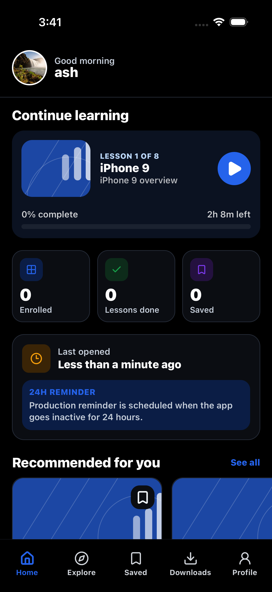
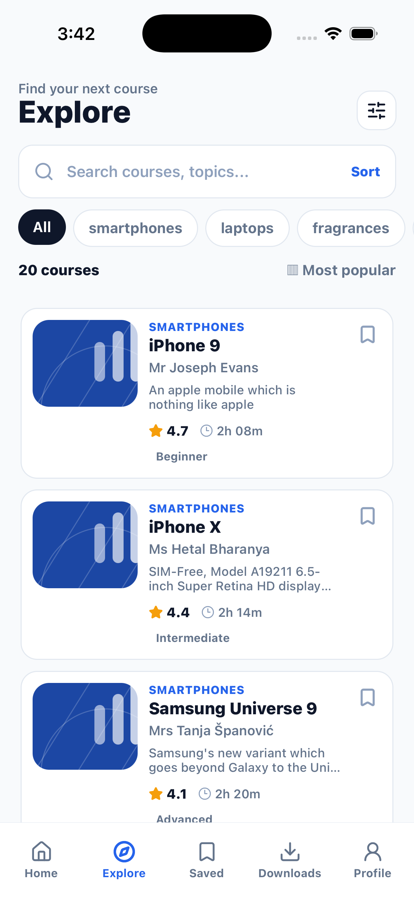
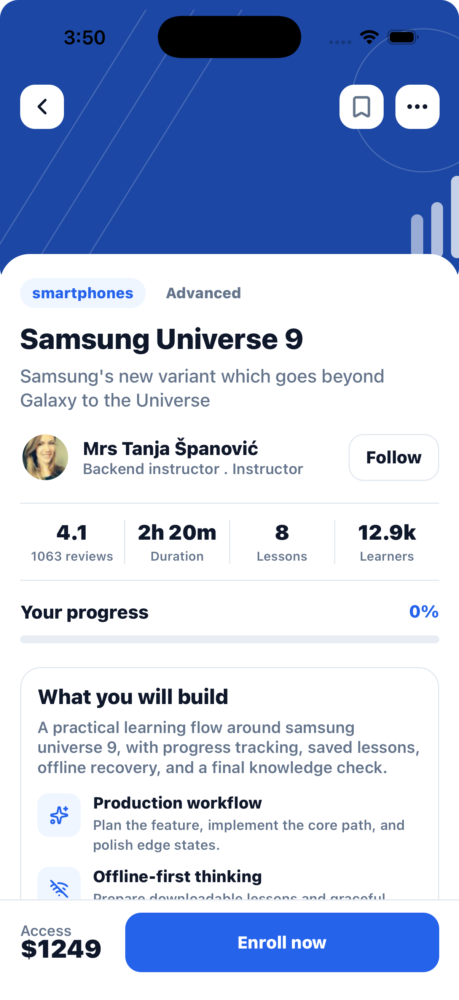
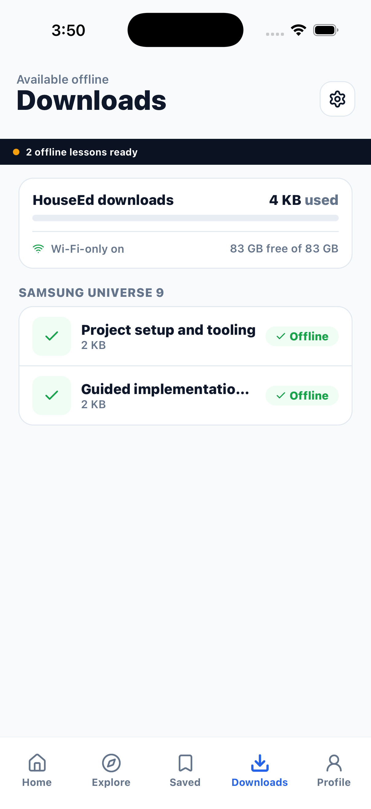
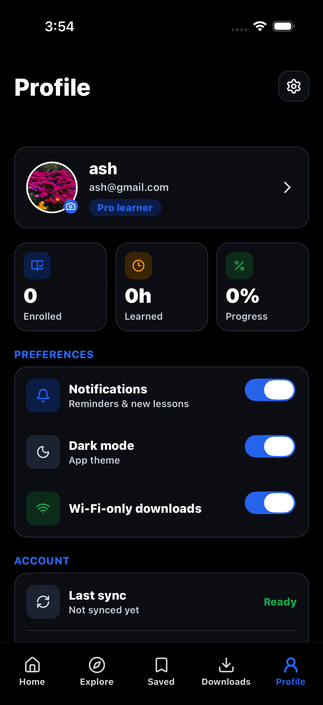

# HouseEd LMS – React Native Expo Mobile App

[Watch Demo](assets/demo/DemoVideo.mp4)
**[Download APK](https://expo.dev/accounts/arpit12mish/projects/myAssign/builds/c68afcbb-62f0-4c78-ba7a-d6ff3d7120e6)** 

HouseEd is a production-style Mini LMS built with **React Native Expo**, **TypeScript strict mode**, **Expo Router**, **NativeWind**, **Expo SecureStore**, and **AsyncStorage**. It is aligned with the assignment requirements: authentication, course catalog API integration, bookmark persistence, WebView course content, local notifications, offline states, retry handling, optimized lists, downloads, profile management, and a preference-driven dark mode.

> Built and designed by [Arpit Mishra](https://www.linkedin.com/in/mish12arpit-187075288/)
> Mail : mish12arpit@gmail.com

---

## **Features**

| Feature | Description |
|----------|--------------|
| **Auth** | Login/register through `/api/v1/users` endpoints with access and refresh tokens stored in Expo SecureStore |
| **Auto-login** | Restores a valid SecureStore session on app restart |
| **Account Recovery** | Email verification, forgot password, reset password, change password, refresh token, logout, and Google login redirect |
| **Course Catalog** | Fetches random products as courses and random users as instructors from `https://api.freeapi.app` |
| **LegendList** | Optimized course list with stable keys, memoized cards, pull-to-refresh, search, and filters |
| **Bookmarks** | Bookmark toggle persisted through AsyncStorage with a 5+ bookmark local notification and saved-count badge |
| **Course Details** | Course hero, instructor, stats, curriculum, enroll/resume state, progress, and download actions |
| **WebView Reader** | Local HTML lesson content with native-to-web context/header injection, theme sync, and web-to-native progress messages |
| **Native Features** | Expo Notifications, in-app notifications, Expo FileSystem downloads, Expo ImagePicker avatar updates, Expo Network offline banner |
| **State Management** | Global React store with SecureStore for tokens and AsyncStorage for non-sensitive app data |
| **Error Handling** | API timeout, retry logic, cached fallback, friendly errors, and WebView reload states |
| **Dark Mode** | Persisted app preference that switches full screens to black surfaces, white text, blue active controls, and light-grey inactive controls |

---

## **Design System**

The refreshed mobile LMS visual system uses the short brand name **HouseEd** for **House of Edtech**. The system is aligned with the assignment brief: Expo Router-ready screen anatomy, NativeWind tokens, SecureStore auth states, AsyncStorage bookmark/progress states, WebView reader states, notifications, downloads, offline handling, and a fully documented dark-mode palette.

- Visual board: [docs/houseed-design-system.html](docs/houseed-design-system.html)
- Implementation spec: [docs/houseed-design-system.md](docs/houseed-design-system.md)
- Code tokens: [design-system/tokens.ts](design-system/tokens.ts)

---

## **Tech Stack**

| Category | Technology |
|-----------|-------------|
| Framework | Expo SDK 54 / React Native 0.81 |
| Language | TypeScript with `strict: true` |
| Navigation | Expo Router |
| Styling | NativeWind / Tailwind tokens |
| Sensitive Storage | Expo SecureStore |
| App Storage | AsyncStorage |
| Lists | `@legendapp/list` LegendList |
| Web Content | `react-native-webview` |
| Native APIs | Expo Notifications, FileSystem, Network, ImagePicker |

---

## **Project Structure**

```text
app/                    Expo Router routes
app/(auth)/             Login, register, password recovery, email verification
app/(tabs)/             Home, Explore, Saved, Downloads, Profile
app/course/[id].tsx     Course detail and enrollment
app/lesson/[id].tsx     WebView lesson reader
components/             NativeWind UI primitives and course cards
services/               API, auth, courses, downloads, notifications, storage
store/                  Global app state provider
types/                  Strict TypeScript domain models
design-system/          Code design tokens
docs/                   Visual and implementation design-system docs
```

---

## **Setup**

Prerequisites:

- Node.js **20 LTS** or **22 LTS**
- npm
- Expo CLI through `npx`
- Android Studio or Xcode if running on a local emulator/simulator
- Expo Go or a development build for physical-device testing

Install dependencies:

```bash
npm install
```

Run static validation:

```bash
npm run typecheck
```

Start Metro:

```bash
npm start
```

Recommended local runtime: **Node 20 or 22 LTS**. Node 25 can trigger an Expo CLI/freeport startup error before Metro finishes booting.

Useful local commands:

```bash
npm run ios
npm run android
npm run web
```

For a clean local run:

1. Install dependencies with `npm install`.
2. Add the environment variable below if you want to override the default API URL.
3. Run `npm run typecheck`.
4. Run `npm start`.
5. Press `i` for iOS, `a` for Android, or scan the QR code with Expo Go/development build.

---

## **Environment Variables**

The app works without a local `.env` file because it falls back to the assignment API base URL. To make the API target explicit, create `.env.local`:

```bash
EXPO_PUBLIC_API_BASE_URL=https://api.freeapi.app
```

| Variable | Required | Default | Purpose |
|----------|----------|---------|---------|
| `EXPO_PUBLIC_API_BASE_URL` | No | `https://api.freeapi.app` | Base URL for FreeAPI auth, random users, random products, and user endpoints |

For EAS cloud builds, configure the same value in the Expo dashboard or through EAS environment variables instead of committing a `.env` file.

---

## **Assignment Coverage**

| Requirement | Implementation |
|-------------|----------------|
| Authentication | FreeAPI login/register, SecureStore token persistence, auto-restore, logout, refresh token, Google redirect, email verification, password recovery |
| Profile | User identity card, editable avatar through image picker, enrolled/progress/learned stats, preferences, sync status |
| Course catalog | Random products mapped to courses, random users mapped to instructors, search, category filters, pull-to-refresh, cached fallback |
| Course detail | Hero, instructor, rating/duration/lesson stats, enrollment state, bookmark persistence, curriculum, downloads |
| WebView | Local HTML lesson template, injected context and headers, validated `postMessage` payloads, reading progress, completion action, error state |
| Notifications | Permission request, 5+ bookmark notification, 24-hour inactivity reminder, 15-second reviewer preview, in-app completion/download notifications |
| State persistence | SecureStore for access/refresh tokens; AsyncStorage for courses, bookmarks, enrollment, progress, downloads, preferences, sync timestamps |
| Performance | LegendList, memoized course cards, stable keys, cached course payloads, pull-to-refresh without rebuilding heavy rows |
| Error/offline | Timeout, retry, friendly errors, offline banners, cached data, WebView reload state, generated offline lesson package if remote download fails |
| UI/UX | HouseEd design system, responsive spacing, accessible touch targets, icon labels, persisted dark mode |

---

## **Key Architecture Decisions**

- SecureStore is used only for auth tokens and sensitive session values. Access tokens are stored under `houseed.auth.token`; refresh tokens are stored under `houseed.auth.refresh`.
- SecureStore writes use `SecureStore.WHEN_UNLOCKED_THIS_DEVICE_ONLY`, so tokens are device-local and available only after the device has been unlocked.
- AsyncStorage is used for course cache, bookmarks, enrollment, progress, downloads, and preferences.
- API calls use a typed wrapper with timeout, retry, auth header injection, and friendly errors.
- Course catalog uses LegendList with `recycleItems`, stable `keyExtractor`, estimated item size, and memoized cards.
- WebView lessons use injected JavaScript for native-to-web context and `postMessage` for reading progress/completion.
- Offline UX is visible but calm: cached courses remain available and the banner explains the state.
- Dark mode is preference-driven from the app store, not just OS-level styling. Screens read `preferences.darkMode` and apply explicit black/near-black surfaces so the page changes immediately.
- Downloads try the remote file first; if the host blocks direct file access, the app creates a local offline HTML lesson package instead of leaving a failed item.

---

## **Security Notes**

- Access tokens and refresh tokens are never written to AsyncStorage.
- The cached user profile is stored in AsyncStorage because it is non-sensitive display data.
- Authenticated requests read the access token from SecureStore at request time and inject `Authorization: Bearer <token>`.
- A `401` response on authenticated requests attempts refresh-token recovery once, then retries the original request.
- Logout calls the backend logout endpoint and clears both SecureStore token keys locally even if the network request fails.

---

## **Screenshots And Demo**

- Demo video: [assets/demo/DemoVideo.mp4](assets/demo/DemoVideo.mp4)
- Design-system board: [docs/houseed-design-system.html](docs/houseed-design-system.html)

Main screen screenshots are stored in `assets/screenshots/`:

| Home | Explore |
|------|---------|
|  |  |

| Course Detail | Downloads | Profile |
|---------------|-----------|---------|
|  |  |  |

---

## **APK Build**

The included `eas.json` has Android APK profiles:

- `development`: development client + internal distribution + APK
- `preview`: internal distribution + APK
- `production`: Android App Bundle command for store-style release

Build an APK:

```bash
npx eas build -p android --profile preview
```

Build a development APK:

```bash
npx eas build -p android --profile development
```

Install a recent Android build on an emulator:

```bash
npx eas build:run -p android --latest
```

Expo’s APK build docs note that Android App Bundles are the default for store distribution, while APK profiles need `android.buildType: "apk"`, `distribution: "internal"`, or a Gradle command that produces an APK. See Expo’s official APK guide: https://docs.expo.dev/build-reference/apk/

---

## **Known Issues / Limitations**

- FreeAPI registration can return a user without an access token. The app handles this by attempting login with the same credentials after a successful register response.
- Google login depends on the backend redirecting back with `accessToken` and `refreshToken` query parameters; the app is configured with the `houseed://` scheme for deep-link callback handling.
- Some demo download URLs can return `403`; the app falls back to a generated offline HTML lesson package so offline functionality remains demonstrable.
- Automated Jest/RTL coverage is not included yet; validation currently relies on TypeScript checks and manual simulator/device testing.

---
